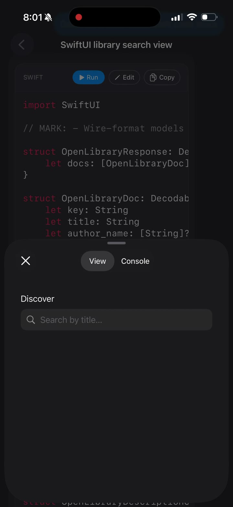

<div align="center">

# 🔥 Kiln

### A live Swift / SwiftUI interpreter you can embed in any iOS or macOS app.

[](https://swift.org)
[](https://swift.org)
[](https://swift.org/package-manager/)
[](LICENSE)
[](Tests/KilnTests)

[**Demo**](Resources/demo.mp4) — paste real Swift into your app, see it run.

<a href="Resources/demo.mp4">
  
</a>

</div>

---

## What is Kiln?

Kiln parses, evaluates, and renders Swift source code at runtime — no compiler involved. You give it a string of Swift; it gives you back a real `SwiftUI` view.

It's the engine behind the live-preview feature in [Haplo](https://haplo.app) and is now standalone for anyone who wants to ship a code playground, AI-generated UI, in-app templates, or a SwiftUI tutorial app.

```swift
import Kiln

let result = Kiln.run("""
struct ContentView: View {
    @State var count = 0
    var body: some View {
        VStack {
            Text("Tapped \\(count) times")
            Button("Tap me") { count += 1 }
        }
    }
}
""")

// result.view is an AnyView you can drop anywhere.
```

---

## Install

Add to your `Package.swift`:

```swift
dependencies: [
    .package(url: "https://github.com/haplollc/Kiln.git", from: "0.1.0"),
],
targets: [
    .target(name: "MyApp", dependencies: ["Kiln"]),
]
```

Or in Xcode: **File ▸ Add Package Dependencies…** → `https://github.com/haplollc/Kiln`

---

## Quick start

Drop `KilnView` into any SwiftUI view tree. It re-runs every time the `code` string changes.

```swift
import SwiftUI
import Kiln

struct Playground: View {
    @State private var source = """
    struct Demo: View {
        var body: some View { Text("hello, kiln") }
    }
    """

    var body: some View {
        VSplitView {
            TextEditor(text: $source).font(.system(.body, design: .monospaced))
            KilnView(code: source)
        }
    }
}
```

That's it. Type Swift on the left, see the rendered view on the right.

---

## What's supported

| Area | Status |
|------|--------|
| Structs (incl. `View` conformance + `@State`, `@Binding`) | ✅ |
| Computed view properties (`var body`, `var x: some View`) | ✅ |
| Forward references (using a type defined later in the file) | ✅ |
| `if` / `else if` / `else` (incl. `if let`, multi-clause `if let A, B`) | ✅ |
| `switch` with enum-case matching | ✅ |
| `guard`, `guard let`, multi-clause `guard A, B else` | ✅ |
| `for`-in, `while`, `defer`, `do`/`catch`, `throw`, `try` / `try?` / `try!` | ✅ |
| `async` / `await`, `Task { }`, SwiftUI `.task` modifier | ✅ |
| Closures, trailing closures, `$0` shorthand, labeled trailing closures | ✅ |
| `let x: T?` deferred initialization | ✅ |
| Enums with associated values + member functions | ✅ |
| Extensions (member functions) | ✅ |
| SwiftUI: `VStack` / `HStack` / `ZStack` / `ScrollView` / `LazyVGrid` / `LazyHGrid` | ✅ |
| SwiftUI: `NavigationStack` / `NavigationLink` with closure destinations | ✅ |
| SwiftUI: `AsyncImage` with `switch phase` branches | ✅ |
| SwiftUI: `ForEach`, `ForEach(_, id:)`, `Identifiable` rows | ✅ |
| Foundation: `URL`, `URLSession.shared.data(from:)`, `URLComponents`, `URLQueryItem` | ✅ |
| `JSONDecoder().decode(T.self, from:)` with auto-schema tagging | ✅ |
| Per-instance `@State` scoping across `NavigationLink` pushes | ✅ |
| `print(...)` capture into `KilnResult.consoleOutput` | ✅ |

See [STATUS.md](STATUS.md) for the full feature matrix and known limitations.

---

## How it works

```
your Swift source
       │
       ▼
   ┌────────┐    ┌────────┐    ┌─────────┐    ┌──────────┐
   │ Lexer  │───▶│ Parser │───▶│ AST     │───▶│ Renderer │───▶ SwiftUI view
   └────────┘    └────────┘    │ + State │    └──────────┘
                               └─────────┘
                                    │
                                    ▼
                              SwiftRunnerState
                              (variables, @State,
                               functions, schemas)
```

- **Lexer** tokenises Swift source.
- **Parser** builds a `ViewNode` AST with a forward-reference resolution pass.
- **ViewBuilder** walks the AST and produces real `AnyView`s.
- **SwiftRunnerState** is `ObservableObject` + `@Published` — SwiftUI re-renders whenever the source mutates state, exactly like a real `@State` view.

---

## Examples

[`Examples/LibraryApp.swift`](Examples/LibraryApp.swift) — a complete Open Library search app: live network requests, JSON decode, `NavigationLink` push, per-instance `@State`, async details fetch. Drop it into a `KilnView` to run it.

---

## API

```swift
public enum Kiln {
    /// Parse, evaluate, and render Swift source. Pure interpretation — no compile step.
    @MainActor public static func run(_ code: String) -> KilnResult
}

public struct KilnResult {
    public let view: AnyView?
    public let consoleOutput: String
    public let errors: [String]
    public var hasView: Bool
}

public struct KilnView<ErrorContent: View>: View {
    public init(code: String)
    public init(code: String, @ViewBuilder errorContent: @escaping ([String]) -> ErrorContent)
}
```

That's the whole public surface. Everything else is `internal` and free to evolve.

---

## Limitations

Kiln is an **interpreter**, not a compiler. A handful of patterns aren't covered yet:

- Custom `init(from decoder: Decoder)` decoders (two-name `(from decoder:)` parameter signature)
- Nested type declarations (`struct X { struct Y { } }`)
- Generic type parameters
- Protocols with associated types
- `Combine` publishers / subscribers
- Direct `JSONSerialization.jsonObject(with:)` (use `JSONDecoder` instead)

When Kiln encounters something it can't handle, it reports a parser error rather than crashing. See [STATUS.md](STATUS.md) for the full list and current roadmap.

---

## Performance

- 306 tests, full suite runs in ~2s on M-series Macs.
- Typical real-world payload (3-400 lines of SwiftUI with `@State` + networking): parses in single-digit ms, renders at SwiftUI's native frame rate after warmup.
- No allocations in the parsing hot path beyond what Foundation requires.

---

## License

MIT. See [LICENSE](LICENSE). Use it for whatever you want.

---

## Credits

Built by [@jc_builds](https://twitter.com/jc_builds) at [Haplo](https://haplo.app). Originally the live-preview engine in Haplo's iOS app; carved out as a standalone package because other people kept asking for it.

If you ship something cool with Kiln, [tell me about it](https://twitter.com/jc_builds).
